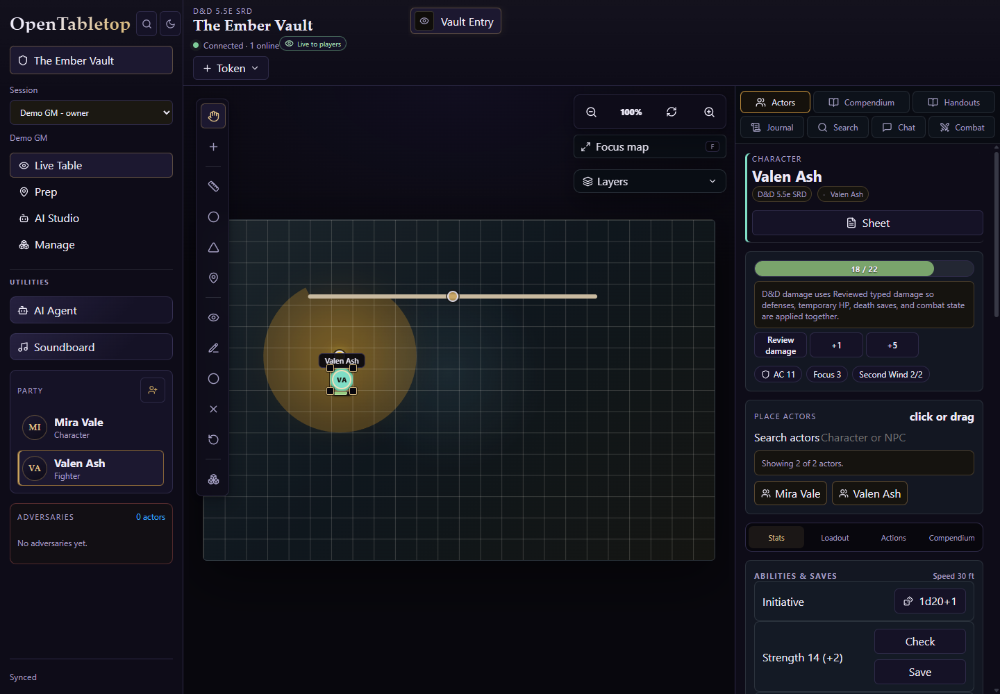
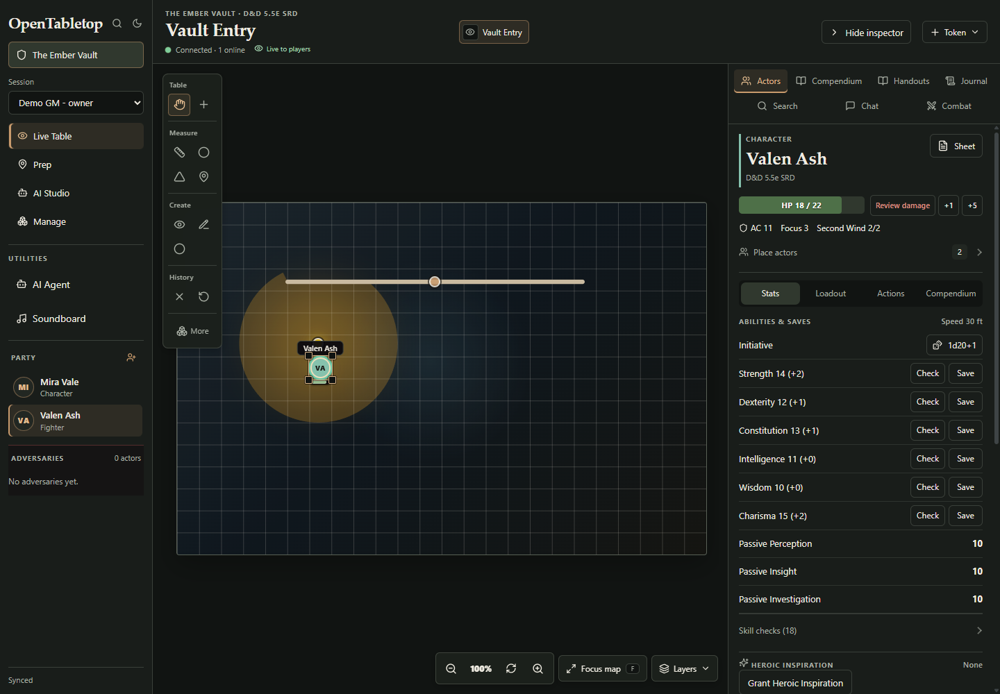
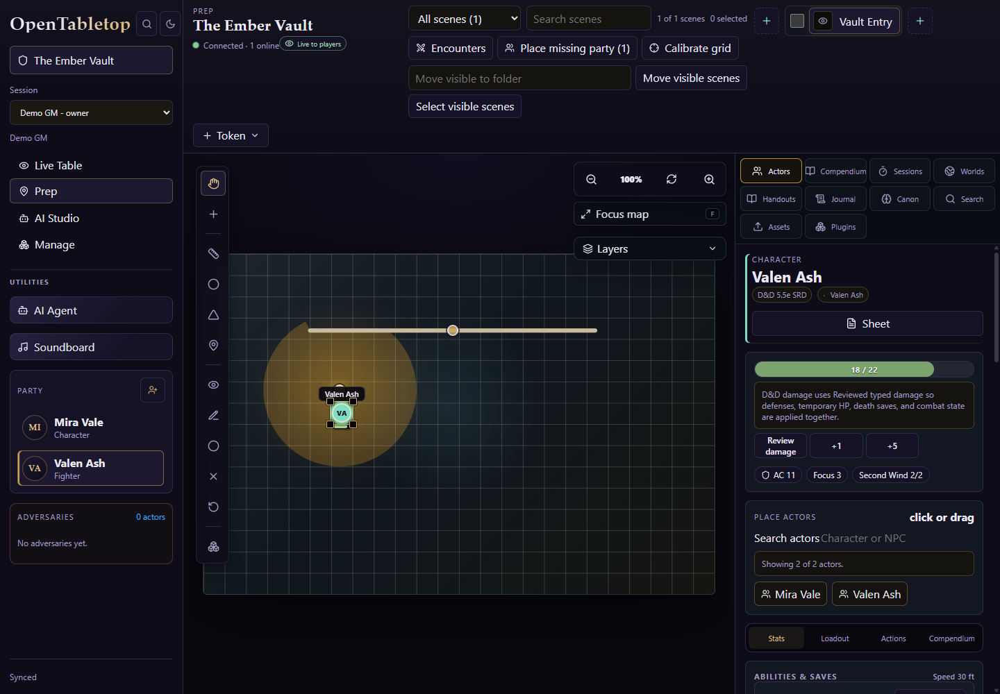
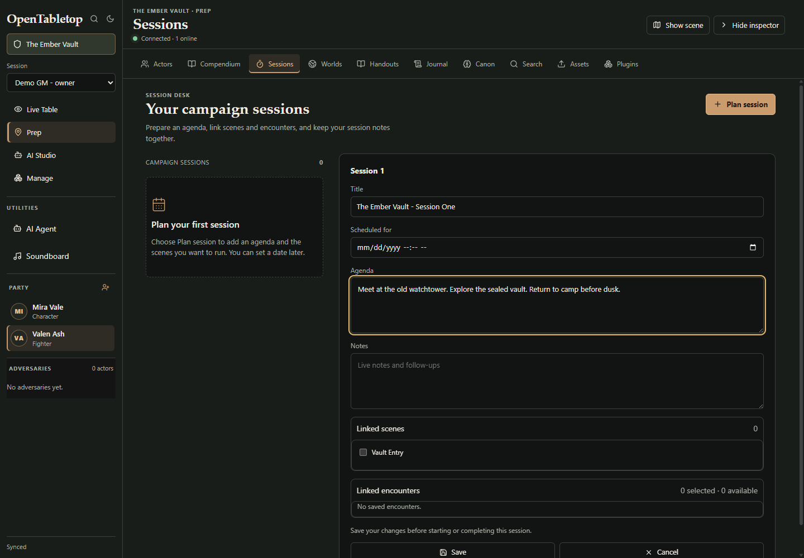
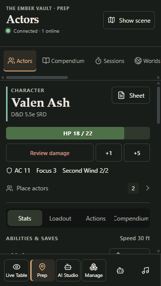
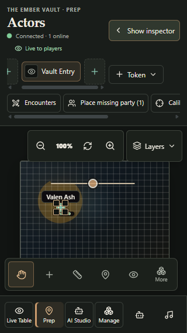

# UX revision - 2026-09-05

This revision follows a visual and interaction review in actual Google Chrome. The first gauntlet fixed clipping and correctness issues, but did not adequately address the everyday UI hierarchy. This pass changes the product experience as well as verifying it.

## Changes and acceptance criteria

| Area | Revised behavior | Verification |
| --- | --- | --- |
| Entry | Branded introduction, clear sign-in form, and a visible Explore demo action. | Chrome screenshot and bootstrap journey. |
| Live table | Scene is the main heading; slimmer navigation, grouped map tools, and a collapsible inspector give the board more room. | Chrome desktop/phone review, focus/inspector browser interactions, and player permissions. |
| Actors | Identity, HP, AC, resources, and ability rolls precede secondary configuration. Placement, recovery, damage details, token settings, and raw actor details expand when needed. | Chrome first-viewport inspection, disclosure browser interactions, and unchanged combat journeys. |
| Preparation | Sessions, Worlds, Handouts, and other writing/search panels use the main workspace with an optional scene preview. Sessions and handouts have distinct list and editing areas; opening an editor scrolls to and focuses its title without refocusing on shared-state refreshes. | Chrome draft writing, hide/reopen draft preservation, content-space browser assertions, and editor concurrency journeys. |
| Campaign settings | Current settings and the next setup step lead; new/duplicate campaign actions are secondary. Completed steps are distinct from the single next step. | Chrome review and existing setup/resume journeys. |
| Short phones | Scene and inspector use separate full views at up to 640 by 680 pixels, with explicit Show scene / Show inspector controls and mounted editor state. Multiple-campaign menus stay visible and reachable above the bottom rail. | Chrome 320 by 568 review, board hit-testing, and actual campaign switching. |
| Visibility | Hidden chat retains unread counts and shows a badge; reopening clears the count. Showing the inspector exits map focus. Explicit scene actions restore the map. | Dedicated browser interactions and independent source review. |

## Visual evidence

Screenshots below use the same isolated demo campaign at 1440 by 1000 pixels. The Prep comparison shows the previous default layout and the new Sessions editing workspace, rather than identical selected tabs.

| Live table before | Live table after |
| --- | --- |
|  |  |

| Previous Prep workspace | Sessions workspace after |
| --- | --- |
|  |  |

[Entry screen](ux-2026-09-05/ux-after-entry.png) and [campaign settings](ux-2026-09-05/ux-after-manage.png) are also captured. Screenshots contain isolated demo data. The session title and agenda shown in the editor were an unsaved manual validation draft, subsequently canceled.

| Short-phone inspector | Short-phone scene |
| --- | --- |
|  |  |

## Review and verification notes

Independent review found and corrected hidden-chat read tracking, inspector restoration from focus mode, and explicit scene navigation from content workspaces. Initial responsive checks then found a mobile grid collision, clipped bottom navigation, and excessive Prep header height. Those were repaired without relaxing the existing hit-testing assertions.

The final visual review also identified an unusable map slice on short phones and a hidden menu in the multiple-campaign switcher. Both repairs passed independent source review and dedicated browser cases. Actual Chrome inspection confirmed the separate scene and inspector views, and that tapping a token keeps the map visible. A subsequent phone form pass corrected a clipped creation action and made newly opened session/handout editors immediately reachable. The asset-search geometry diagnostic identified a fractional 0.109-pixel overflow at the navigation boundary with a correct input hit target; added scroll breathing room preserves full visibility without relaxing the assertion.

The first integrated UX checks exposed stale source-location assertions after stateless navigation markup moved to a dedicated module, two outdated empty-state strings, and the existing App.tsx line budget. The assertions were kept attached to their actual implementation, and the presentation component extraction retained the unchanged architecture budget. These were failed intermediate attempts, not passing final checks.

The complete default browser run additionally exposed a desktop overlap with many scenes: map-focus status markup broke an adjacent-sibling header selector, allowing scene tabs to cover Show inspector. An explicit focus-mode selector restores the separate grid columns. The regression case now creates ten scenes through the API, verifies at least eleven tabs, and restores the inspector with an ordinary click. The other failed checks referenced renamed headings, a removed user label, a removed duplicate armor-class metric, or an actor selection changed by preceding journeys; their replacements continue checking the actual visible controls and values.

## Final repository verification

The final `pnpm check` completed with exit 0 after the phone layout, editor-focus, and many-scene map-focus corrections: **2,344 passed and one skipped across 383 passing files**. Lint, package typechecks, browser typecheck, tests, and all 15 build tasks passed. The web suite executed freshly (797 tests in 152 files), as did desktop (20 tests in two files). Thirteen unchanged package suites used validated Turbo cache results, including the API's 861 passing tests and one external identity skip, which had executed freshly earlier in the gauntlet. Fourteen build tasks were cached and one executed freshly. The existing nonfatal bundle-size warning remains.

This is 73 more passing tests and seven more files than the original baseline. The skip requires an external OIDC/SCIM provider. Evidence: `output/gauntlet/ux-final-gate.log`, `ux-final-gate.exitcode`, and `ux-final-gate-summary.md`.

The [phone session editor screenshot](ux-2026-09-05/ux-after-phone-session.png) was captured after switching to the scene and back; its unsaved title is preserved and visible. The associated browser case also checks title focus when opening the editor, a complete creation-button label, usable map geometry, and pointer selection without losing the scene.

## Final browser verification

**All 79 unique Chromium cases passed, with no skips.** This combines the full default run and targeted reruns after the specific corrections described above; it does not mean the initial broad invocation passed without failures.

| Configuration | Verified result |
| --- | --- |
| Default | 76 unique cases: 71 passed in the full run, four passed in the corrected-case batch, and the armor-class/rules-trace case passed its final rerun. |
| Bootstrap | One clean-deployment owner bootstrap and starter-campaign journey passed. |
| Canonical | One complete GM/player D&D session, API restart, and resume journey passed. |
| Full combat | One level-3 journey passed, including Second Wind followed by Attack, Sneak Attack, hostile defeat, and combat completion; zero browser errors. |

The desktop regression creates ten additional inactive scenes through the API, checks at least eleven tabs, and cleans up its own scenes. Phone cases verify campaign switching, contiguous usable map space, actual pointer interaction, complete action labels, focused editor input, and draft retention. Existing permission and gameplay assertions were retained.

Evidence is in ignored local `output/gauntlet/`: `ux-e2e-default-final.log`, `ux-e2e-corrected-five.log`, `ux-e2e-t30-final3.log`, `ux-e2e-bootstrap.log`, `ux-e2e-canonical.log`, and `ux-e2e-full-combat.log`. Fresh combat evidence is preserved in `ux-e2e-full-combat-evidence/`. All 13 pre-existing combat artifacts were restored and their SHA-256 hashes verified in `ux-full-combat-artifacts-restored.json`.

Final `pnpm e2e:typecheck` passed after all browser selector/fixture corrections (`ux-e2e-typecheck-complete.log`, exit 0). The combat evidence records 15 turns, all three goblins dead, combat inactive, Second Wind healing from 20 to 24 HP followed by Attack in the same turn, Sneak Attack for 10 damage, and zero browser errors.

The local web preview and API/storage health checks returned success after the source changes. Preview: `http://127.0.0.1:5173`; API health: `http://127.0.0.1:4000/api/v1/health`. Demo storage is isolated in `storage/gauntlet-preview`.

## External service coverage

Browser AI text workflows use the controlled loopback provider injected by the fresh API fixture. Image-generation checks accept either a proposal or the expected Codex app-server-unavailable error. These are workflow and fallback checks; live external text/image generation and model quality were not verified. Browser tests have no explicit skips; the separate API OIDC/SCIM readiness smoke is the known skipped test when provider prerequisites are absent.

## Release limitation

The existing Release Smoke job for PR #67 failed its dependency audit before running release tests: nine high findings in PDF.js, fast-uri, sharp/libvips, and find-my-way. The reviewed UX changes do not modify dependency manifests or the lockfile. A remediation proposal is prepared separately; the audit failure must be resolved before treating the PR as release-ready. The prior OIDC/SCIM smoke-test skip also still requires external provider configuration.
